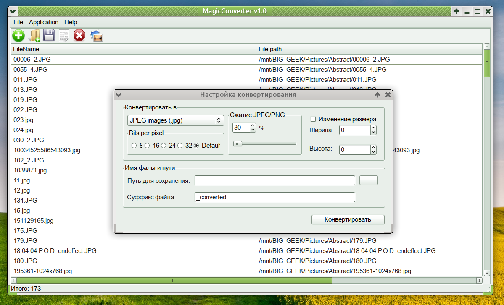

## Welcome to MagicConverter v1.0

### Description
        
MagicConverter - front-end for command 'convert' from **ImageMagick** toolkit.

Short List of MagicConverter functions:

 - packet convert images from/to formats BMP, JPG, GIF, PNG, XMP
 - resize and convert images
 - set quality compression for JPG images
 - convert to grayscale

--------------

### Dependencies

 - Gtk-2.x
 - convert
 - Multilog from Lazarus repo

-------------
### Compiled in

 - Linux Mint 20.3 Una, base: Ubuntu 20.04 focal
 - Lazarus v2.0.6

------------ 
         (c) Copyright 2024 by TechnoMag aka Iliya Kobzev
         
